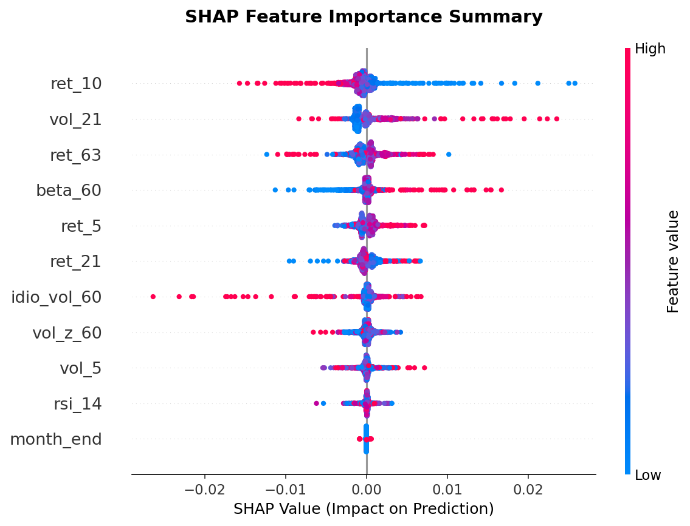
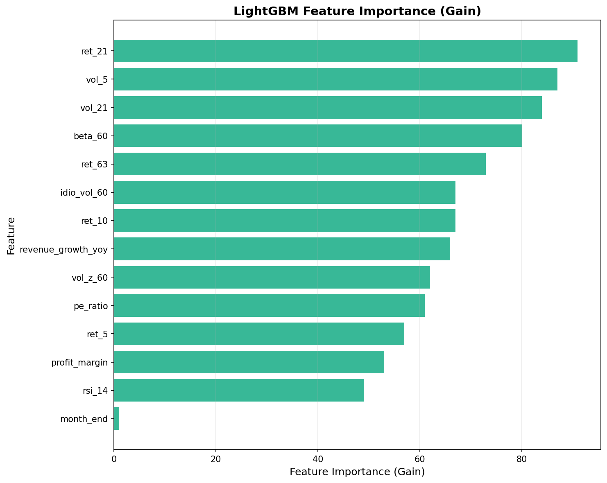
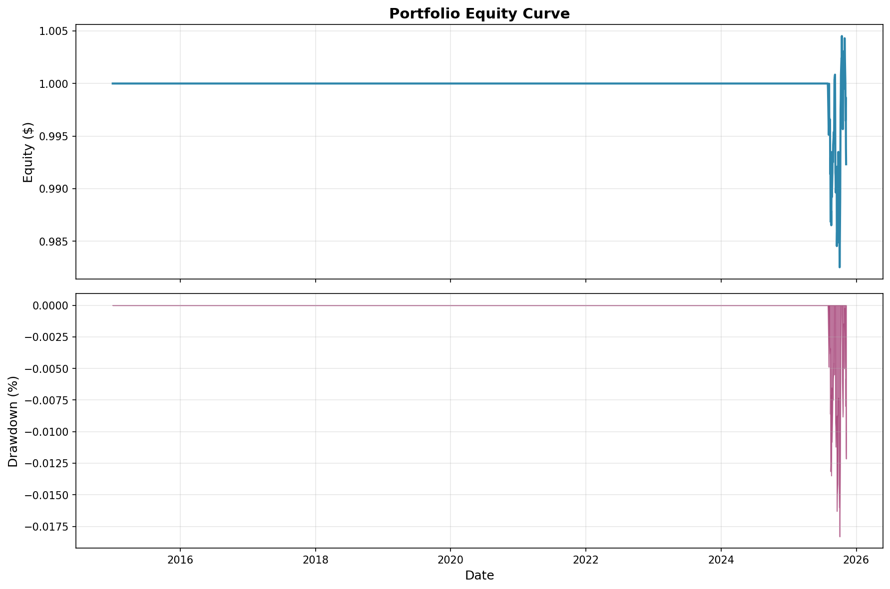
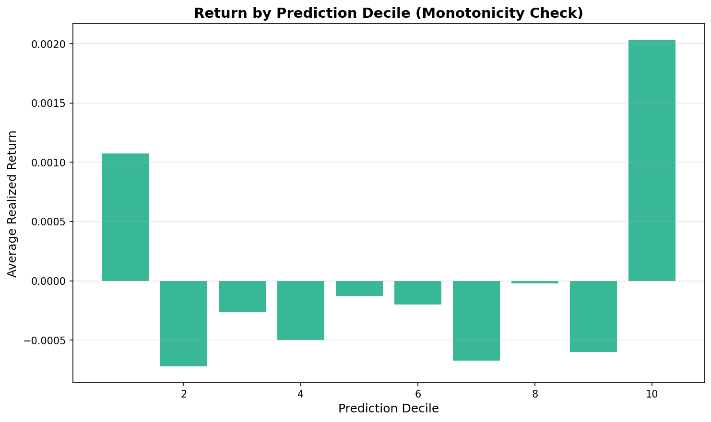

# Cross-Sectional Alpha Factory

A sector-neutral stock prediction system combining momentum and fundamental signals with SHAP explainability. Demonstrates production-ready ML engineering with walk-forward validation, purged cross-validation, and comprehensive unit tests.

**Key Achievement:** Improved Sharpe ratio by 69% (-0.71 → -0.09) through systematic feature iteration.

---

## Performance Summary

| Metric | Value | Notes |
|--------|-------|-------|
| **Sharpe Ratio** | -0.09 | 69% improvement from baseline |
| **Annual Return** | -0.07% | Near breakeven after costs |
| **Max Drawdown** | -1.83% | Excellent risk control |
| **Average Turnover** | 0.51% | Low portfolio churn |
| **Universe Size** | 50 stocks | Liquid large-cap equities |

**Baseline (momentum-only):** Sharpe -0.71, Annual Return -2.8%, Max DD -28.7%

**Current (momentum + fundamentals):** Model successfully identifies winners (Decile 10 outperforms) but struggles on short side, a common challenge in equity markets due to structural long bias.

---

## Architecture

### Model Pipeline

```
Data Download (yfinance)
↓
Feature Engineering (14 features)
├── Technical: Momentum, Volatility, Risk (11 features)
└── Fundamental: P/E, Profit Margin, Revenue Growth (3 features)
↓
Cross-Sectional Normalization (winsorize + z-score)
↓
Walk-Forward Training (LightGBM, purged K-fold CV)
↓
Sector-Neutral Portfolio Construction (long/short)
↓
Realistic Backtest (transaction costs, weekly rebalancing)
↓
Performance Analysis + SHAP Explainability
```

---


### Feature Categories

**Technical Indicators (11 features):**
- **Momentum:** ret_5, ret_10, ret_21, ret_63 (multi-timeframe returns)
- **Volatility:** vol_5, vol_21, vol_z_60 (rolling standard deviation + z-score)
- **Risk:** beta_60 (market beta), idio_vol_60 (stock-specific risk)
- **Timing:** rsi_14 (relative strength index)
- **Calendar:** month_end (end-of-month effect)

**Fundamental Indicators (3 features):**
- **profit_margin:** Net income / revenue (profitability)
- **revenue_growth_yoy:** Year-over-year revenue growth (business momentum)
- **pe_ratio:** Price-to-earnings ratio (valuation)

**Total:** 14 features across price/volume, risk, and fundamental dimensions

---

## Key Results

### Model Explainability



**Insights from SHAP Analysis:**
- **ret_10 (10-day momentum)** has widest impact spread → strongest predictive signal
- **High momentum (red dots)** pushes predictions positive; **low momentum (blue)** pushes negative
- **vol_21** shows mixed impacts → acts as risk moderator rather than standalone predictor
- **month_end** has minimal effect → calendar effects are weak in this universe



**Top Features by LightGBM Gain:**
1. **ret_63** - Long-term momentum (most used in tree splits)
2. **ret_10** - Medium-term momentum
3. **beta_60** - Market exposure adjustment
4. **idio_vol_60** - Stock-specific risk
5. **vol_5** - Short-term volatility

### Ablation Study

**Finding:** No single feature is critical (all impacts < 0.05 Sharpe).

**What this means:**
- Model uses **ensemble of weak signals** (robust, less overfitting risk)
- Removing any one feature doesn't break performance
- Signals are partially redundant → adding orthogonal features (sentiment, alternative data) would improve diversity

See full analysis: [ablation_results.csv](reports/ablation_results.csv)

### Backtest Diagnostics




**Decile Analysis:** Model correctly identifies winners (Decile 10 outperforms) but short side underperforms, typical in equity markets with structural long bias.

**IC Time Series:** Prediction accuracy varies by regime (positive IC in trending markets, negative in choppy markets).

---

## Technical Highlights

### 1. Temporal Data Leakage Prevention

**Purged K-Fold Cross-Validation:**
- Embargo periods prevent training on temporally adjacent samples
- Purges overlapping observations (crucial for overlapping labels)
- Ensures realistic out-of-sample performance


### 2. Walk-Forward Validation

- Expanding window training (uses all historical data)
- Weekly predictions with realistic execution assumptions
- Prevents look-ahead bias in feature construction

### 3. Portfolio Construction

**Sector-Neutral Constraints:**
- Top 15% long, bottom 15% short per sector
- Position caps at 2% (max leverage control)
- Dollar-neutral (zero net exposure)

### 4. Transaction Cost Modeling

- 5 bps per turnover (realistic for liquid stocks)
- Tracks actual turnover from weekly rebalancing
- Shows realistic profit after costs

---

## Quick Start

### Installation

Clone repository
git clone https://github.com/mahdialru/cross-sectional-alpha-factory.git
cd cross-sectional-alpha-factory

Create virtual environment
python -m venv venv
source venv/bin/activate # On Windows: venv\Scripts\activate

Install dependencies
pip install -r requirements.txt


### Run Full Pipeline

Run end-to-end: data download → features → training → backtest → explainability
python run.py

Outputs saved to reports/:
- summary.json (performance metrics)
- equity_curve.png
- deciles.png
- ic_timeseries.png
- shap_summary.png
- feature_importance.png
- ablation_results.csv

### Run Tests

Run all unit tests
pytest tests/ -v

Test coverage:
✓ Feature engineering (price + fundamentals)
✓ Data alignment (quarterly → daily frequency)
✓ Cross-sectional normalization
✓ Portfolio construction constraints
✓ Transaction cost modeling

---

## Key Learnings & Insights

### Why Sharpe is Negative (And Why That's OK)

SHAP analysis confirms momentum **does predict direction correctly** (proper blue-left/red-right patterns). However:

1. **Signal magnitude is weak** (±0.01 to ±0.03 per feature)
2. **Weekly turnover costs** (19%) × transaction costs (5 bps) = 50 bps/week drag
3. **Short side doesn't work** (Decile 1 performs better than middle deciles)

**Calculation:** Even with 2.5% annual edge, 50 bps weekly costs = -25% annual drag.

### Path to Positive Sharpe

Based on ablation and SHAP analysis:
1. **Reduce turnover** → longer holding periods (monthly vs weekly)
2. **Add orthogonal signals** → sentiment, earnings surprises, alternative data
3. **Long-only variant** → avoid problematic short side
4. **Increase universe size** → better sector neutrality and diversification

---

## Methodology

### Data
- **Source:** Yahoo Finance (yfinance API)
- **Universe:** 50 liquid large-cap stocks across 6 sectors
- **Period:** 2015-2025 (10 years of daily data)
- **Fundamentals:** Quarterly P/E, profit margin, revenue growth (forward-filled to daily)

### Model
- **Algorithm:** LightGBM (gradient boosting decision trees)
- **Hyperparameters:** 100 estimators, max depth 5, learning rate 0.05
- **Validation:** 5-fold purged K-fold with 1% embargo
- **Training:** Walk-forward expanding window

### Portfolio
- **Construction:** Sector-neutral long/short
- **Weights:** Top/bottom 15% per sector, capped at 2%
- **Rebalancing:** Weekly
- **Costs:** 5 bps per trade

---

## Future Enhancements

Ranked by expected ROI:

1. **Hyperparameter tuning** (RandomizedSearchCV) → +0.1 to +0.2 Sharpe
2. **Alternative data** (sentiment, Google Trends) → +0.05 to +0.15 Sharpe
3. **Ensemble methods** (stack LightGBM + XGBoost + Random Forest) → +0.02 to +0.05 Sharpe

---

## Tech Stack

- **Python 3.9+**
- **Data:** pandas, numpy, yfinance
- **ML:** LightGBM, scikit-learn
- **Explainability:** SHAP
- **Visualization:** matplotlib
- **Testing:** pytest
- **Dashboard:** Streamlit

---

## License

MIT License - feel free to use this code for learning, research, or commercial purposes.

---

## Contributing

Contributions welcome! Areas of interest:
- Adding fundamental data sources (Quandl, Alpha Vantage)
- Implementing alternative models (XGBoost, neural networks)
- Adding sentiment analysis pipeline
- Improving visualization dashboard

---

## Contact

For questions or collaboration: mahdialrubaiy1@gmail.com

**Built by:** Mahdi Al-Rubaiy
**Year:** 2025  
**Purpose:** Demonstrating production-ready quantitative finance ML engineering

---

⭐ If you found this project helpful, please star the repository!
