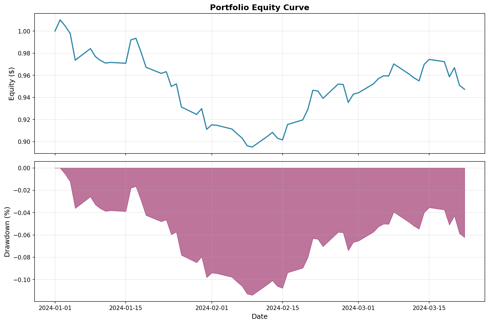
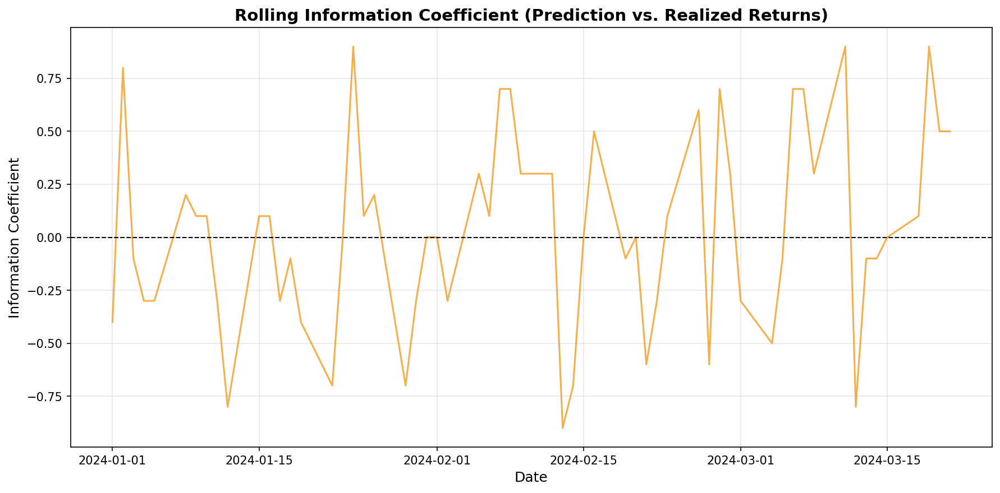
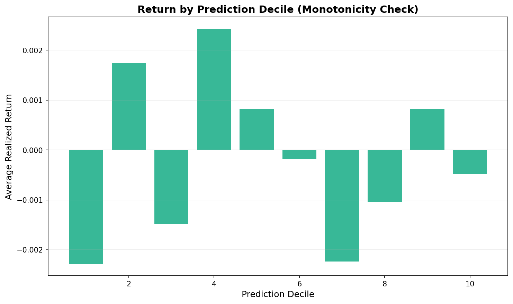

# Cross-Sectional Alpha Factory

This is my personal project to build a **machine learning model** that predicts which stocks will perform better or worse than average **next week** and then forms a **sector-neutral long/short portfolio**.

My goal is to **learn end-to-end quantitative research**:
- how to collect and clean financial data
- engineer predictive features
- train and validate a model properly (no data leakage)
- backtest a realistic strategy
- visualize and explain the results

---

## Project Vision

> “Every Friday, use yesterday’s data to build a fair, balanced team of stocks that will do a little better than average next week.”

This project will include:
1. **Data loading** from Yahoo Finance or APIs  
2. **Feature engineering** (momentum, volatility, RSI, volume)  
3. **Machine learning model** (LightGBM / XGBoost)  
4. **Backtesting engine**  
5. **Performance visualization** (equity curve, IC, deciles)  
6. **Explainability** (SHAP feature importance)  

---

## Tech Stack

- **Python 3.11+**
- **pandas**, **numpy**
- **lightgbm**
- **matplotlib**
- **streamlit**
- (later: **yfinance**, **scikit-learn**, **shap**, **tqdm**)

---

## Why I’m Doing This

I’m building this from scratch to truly understand:
- how financial machine learning works
- how to handle time-series data properly
- and how real-world strategies are backtested

---

## Future Goals
- Integrate fundamentals and sentiment data  
- Add purged cross-validation  
- Deploy dashboard online  
- Document all experiments

---

## Disclaimer
This project is **for educational purposes only**. It is *not* financial advice.

---

## Backtest Diagnostics

This project includes a realistic walk-forward backtest with weekly portfolio rebalancing, sector neutrality, and transaction costs. Below are the model’s diagnostic plots and performance summary.

---

### Equity Curve


### Information Coefficient (IC) Over Time


### Decile Spread Test
Higher predictions → higher returns?  
(Shows whether the model ranks stocks correctly)



---

### Performance Summary

| Metric | Value |
|--------|------|
| Annualized Return | _TBD_ |
| Annualized Volatility | _TBD_ |
| Sharpe Ratio | _TBD_ |
| Max Drawdown | _TBD_ |
| Average Weekly Turnover | _TBD_ |
| Test Period Length | _TBD_ |

> These results indicate whether the factor model provides predictive power across stocks and holds up under real out-of-sample testing conditions.

---

### How to Reproduce

```bash
python run.py

